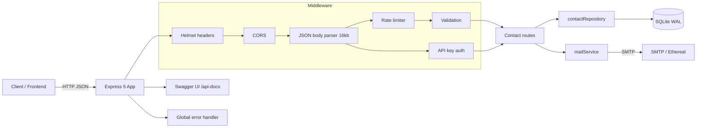

# Contact Form API — Step-by-Step Build Guide

> **Archived: original build playbook.** This document is the original roadmap used to build the Contact Form API. It is preserved as a making-of narrative and reference. The codebase may have evolved since this guide was written, so for the current setup, architecture, and deployment notes always defer to [../README.md](../README.md).

---

> **Project Summary:** Contact Form API is a production-ready REST service that receives contact form submissions, validates and sanitizes them, persists them in SQLite, and notifies an administrator by email. Public clients can submit messages through a single rate-limited, validated `POST` endpoint, while administrative read and delete operations are protected behind an API key with constant-time comparison. Security is layered: Helmet HTTP headers, configurable CORS, IP-based rate limiting (proxy-aware), strict input validation, XSS-safe HTML emails, and prepared SQL statements. The service ships with OpenAPI/Swagger documentation, a polished landing page, graceful shutdown, and an automated Jest + Supertest test suite running against an in-memory database.

Each step below is a self-contained prompt. Execute them in order.

Stack: Node.js, Express 5, better-sqlite3 (WAL), Nodemailer, Helmet, express-rate-limit, dotenv, swagger-jsdoc + swagger-ui-express, Jest + Supertest.

---

## Table of Contents

**PHASE 1 — Backend Foundation**

- STEP 1 — Project Scaffolding & Dependency Setup
- STEP 2 — Environment Configuration
- STEP 3 — Database Connection & Migrations
- STEP 4 — Error Handling Primitives

**PHASE 2 — Contacts Resource**

- STEP 5 — Data Access Layer (Repository)
- STEP 6 — Input Validation Middleware
- STEP 7 — Rate Limiting Middleware
- STEP 8 — Email Notification Service (XSS-safe)
- STEP 9 — Contact Routes (CRUD)

**PHASE 3 — Security & Documentation**

- STEP 10 — API Key Authentication
- STEP 11 — OpenAPI / Swagger Documentation
- STEP 12 — Application Assembly & Landing Page

**PHASE 4 — Testing**

- STEP 13 — Test Harness & Environment
- STEP 14 — Unit & Integration Tests

**PHASE 5 — Polish & Deploy**

- STEP 15 — Hardening, Graceful Shutdown & Scripts
- STEP 16 — Deployment (Render) & Community Files

**Appendices**

- Appendix A — Shared Constants & Environment Variables
- Appendix B — Common Patterns & Pitfalls
- Appendix C — Pre-flight Checklist

---

## Global Build Rules (apply to EVERY step)

- **No git operations.** Do not run `git` commands, do not stage, commit, push, branch, or tag. Version control is handled manually by the user.
- Do not install unapproved packages. Only add a dependency when the step explicitly requires it, and prefer native Node.js APIs.
- Do not run long-running processes (servers, watchers) unless the step or the user explicitly requests it.
- Treat every step as self-contained: read the relevant files, make the change, and verify it independently.
- Keep code clean, readable, and modern (ES6+, async/await). Use descriptive English identifiers in camelCase.
- Prioritize security, validation, accessibility, and performance in every step.
- Never commit secrets. All sensitive values live in `.env`, which is git-ignored.

---

## Architecture at a Glance



The Express app applies security and parsing middleware globally, then routes requests under `/api/contacts`. The public `POST` path runs through the rate limiter and validator; the admin `GET`/`DELETE` paths run through API key authentication. All persistence flows through a thin repository over a single SQLite connection (WAL mode), and email notifications are dispatched asynchronously (fire-and-forget) so SMTP latency never blocks the API response.

---

# PHASE 1 — BACKEND FOUNDATION

---

## STEP 1 — Project Scaffolding & Dependency Setup

**Goal:** Establish the project skeleton, package metadata, and runtime dependencies.

**Files/folders to create:**

- `package.json` (name `contact-form-api`, `type: commonjs`, `main: src/server.js`)
- `src/`, `src/config/`, `src/db/`, `src/middlewares/`, `src/routes/`, `src/services/`, `src/utils/`
- `.gitignore`

**Dependencies:**

```bash
npm install express helmet cors dotenv express-rate-limit better-sqlite3 nodemailer swagger-jsdoc swagger-ui-express
npm install --save-dev nodemon
```

**Implementation notes:**

- Scripts: `start` runs `node src/server.js`; `dev` runs `nodemon src/server.js`.
- `.gitignore` must exclude `node_modules/`, `data/`, `*.db`, all `.env*` variants, logs, OS files, IDE folders, and `coverage/`.

**Acceptance:** `npm install` completes; folder structure exists; `npm run dev` is wired (server itself comes later).

---

## STEP 2 — Environment Configuration

**Goal:** Centralize configuration in a single typed-ish config object loaded from environment variables.

**Files:** `src/config/env.js`, `.env.example`, `.env`

**Implementation notes:**

- Load `dotenv` from the project root explicitly: `require("dotenv").config({ path: path.resolve(__dirname, "../../.env") })`.
- Export a `config` object with groups: `port`, `nodeEnv`, `db.path`, `mail.*`, `rateLimit.*`, `cors.origin`, and `admin.apiKey`.
- Provide sensible defaults so the app boots in development without a full `.env`.
- `.env.example` documents every variable (see Appendix A). Never put real secrets in `.env.example`.

**Security:** `dotenv` does not override variables already present in `process.env`; this lets tests and the host platform inject values safely.

**Acceptance:** `require("./config/env")` returns a fully populated object with defaults when `.env` is absent.

---

## STEP 3 — Database Connection & Migrations

**Goal:** Provide a single, lazily-initialized SQLite connection with an idempotent schema migration.

**Files:** `src/db/database.js`

**Dependencies:** `better-sqlite3`

**Implementation notes:**

- Export `getDatabase()` (memoized singleton) and `closeDatabase()`.
- Create the DB directory with `fs.mkdirSync(dir, { recursive: true })` if missing.
- Enable `journal_mode = WAL` and `foreign_keys = ON` pragmas.
- Run migrations with `CREATE TABLE IF NOT EXISTS contacts (...)` (schema in Appendix A).
- `closeDatabase()` closes the handle and resets the singleton so tests can re-open cleanly.

**Performance:** WAL mode improves concurrent read/write throughput. A single connection avoids file-lock contention with better-sqlite3's synchronous API.

**Acceptance:** Calling `getDatabase()` twice returns the same instance; the `contacts` table exists after first call.

---

## STEP 4 — Error Handling Primitives

**Goal:** Define a consistent error type and a global error handler that returns uniform JSON.

**Files:** `src/utils/ApiError.js`, `src/middlewares/errorHandler.js`

**Implementation notes:**

- `ApiError extends Error` with `statusCode` plus static factories: `badRequest` (400), `unauthorized` (401), `notFound` (404), `tooMany` (429), `internal` (500).
- `errorHandler(err, req, res, next)` returns `{ success: false, error }` with `err.statusCode` for `ApiError`; for unknown errors it logs and returns a generic 500 (never leak internals).

**Acceptance:** Throwing `ApiError.badRequest("x")` yields a 400 JSON response; an unexpected throw yields a generic 500.

---

# PHASE 2 — CONTACTS RESOURCE

---

## STEP 5 — Data Access Layer (Repository)

**Goal:** Encapsulate all SQL behind a repository so routes never touch the database directly.

**Files:** `src/db/contactRepository.js`

**Implementation notes:**

- Expose `create`, `findById`, `findAll({ page, limit })`, `deleteById`.
- Use prepared statements with bound parameters for every query (SQL-injection safe).
- `findAll` computes `offset` and returns `{ data, pagination: { page, limit, total, totalPages } }`.
- Order results by `created_at DESC, id DESC` for deterministic pagination when timestamps collide.

**Acceptance:** Inserting then listing returns the row inside a correct pagination envelope; deleting a missing id returns `false`.

---

## STEP 6 — Input Validation Middleware

**Goal:** Validate and normalize incoming contact payloads before they reach the route.

**Files:** `src/middlewares/validate.js`

**Implementation notes:**

- Validate `name` (2–100 chars), `email` (valid format, max 254), `message` (10–5000 chars).
- Use a single email regex constant. Collect all errors and reject via `next(ApiError.badRequest(errors.join(" ")))`.
- On success, normalize in place: `trim()` all fields and lowercase the email.

**Security/UX:** Server-side validation is authoritative; collecting all errors at once improves client feedback.

**Acceptance:** Invalid input returns 400 with a descriptive message; valid input proceeds with trimmed, lowercased values.

---

## STEP 7 — Rate Limiting Middleware

**Goal:** Throttle submissions per IP to deter spam and abuse.

**Files:** `src/middlewares/rateLimiter.js`

**Dependencies:** `express-rate-limit`

**Implementation notes:**

- Configure `windowMs` and `max` from `config.rateLimit`.
- Enable `standardHeaders`, disable `legacyHeaders`.
- Return a JSON error body shaped like the rest of the API (`{ success: false, error }`).

**Note:** Correct client IP attribution depends on `trust proxy` being set on the app (STEP 15).

**Acceptance:** Exceeding `max` within the window returns 429 with the JSON error body.

---

## STEP 8 — Email Notification Service (XSS-safe)

**Goal:** Send an admin notification email per submission, safely rendering user content.

**Files:** `src/services/mailService.js`, `src/utils/escapeHtml.js`

**Dependencies:** `nodemailer`

**Implementation notes:**

- Memoize a transporter via `getTransporter()`. When no SMTP user is configured, auto-create an Ethereal test account and log the preview URL (development convenience).
- `sendAdminNotification({ name, email, message })` builds both plain-text and HTML bodies and returns `{ messageId, previewUrl }`.
- `escapeHtml()` escapes `& < > " '`. The HTML builder must escape `name`, `email`, and `message` before interpolation to prevent HTML/script injection in the admin's mail client.

**Security:** This is the primary XSS mitigation for the email channel; never interpolate raw user input into HTML.

**Acceptance:** A submission containing `<script>` is rendered as escaped text in the HTML email.

---

## STEP 9 — Contact Routes (CRUD)

**Goal:** Expose the REST endpoints for contacts.

**Files:** `src/routes/contactRoutes.js`

**Implementation notes:**

- `POST /` → `contactLimiter`, `validateContact`, then create + fire-and-forget `sendAdminNotification(...).catch(...)`; respond 201 with the created record. Email failure must not block or fail the response.
- `GET /` → paginated list (clamp `page >= 1`, `limit` to 1–100).
- `GET /:id` → single record or 404.
- `DELETE /:id` → delete or 404.
- Capture `req.ip` as `ip_address` on create.
- All handlers wrap logic in try/catch and forward errors via `next(err)`.

**Acceptance:** Each endpoint returns the documented status codes and response envelope.

---

# PHASE 3 — SECURITY & DOCUMENTATION

---

## STEP 10 — API Key Authentication

**Goal:** Protect administrative read/delete endpoints with an API key.

**Files:** `src/middlewares/auth.js` (consumes `config.admin.apiKey`)

**Implementation notes:**

- `requireApiKey` reads the `x-api-key` header and compares it to `config.admin.apiKey`.
- Use `crypto.timingSafeEqual` over equal-length buffers to avoid timing attacks; treat length mismatch as failure.
- If no key is configured on the server, deny access (`ApiError.internal`) rather than exposing data — fail closed.
- Apply `requireApiKey` to `GET /`, `GET /:id`, and `DELETE /:id`. Keep `POST /` public.

**Security:** Fail-closed default ensures contact PII is never served without an explicitly configured key.

**Acceptance:** Protected routes return 401 without a valid key and 200 with the correct key.

---

## STEP 11 — OpenAPI / Swagger Documentation

**Goal:** Generate interactive API docs from JSDoc annotations.

**Files:** `src/config/swagger.js`, JSDoc `@swagger` blocks in `src/routes/contactRoutes.js` and `src/server.js`

**Dependencies:** `swagger-jsdoc`, `swagger-ui-express`

**Implementation notes:**

- Define OpenAPI 3.0.3 metadata (title, version, description from `package.json`), server `/`, and tags.
- Declare reusable `schemas` (Contact, ContactInput, SuccessResponse, ErrorResponse, Pagination) and a `securitySchemes.ApiKeyAuth` (apiKey, header, `x-api-key`).
- Annotate each endpoint; protected endpoints declare `security: [{ ApiKeyAuth: [] }]` and a 401 response.
- Serve UI at `/api-docs` and raw spec at `/api-docs.json`.

**Acceptance:** `/api-docs` renders all endpoints; protected ones show the authorize/lock affordance.

---

## STEP 12 — Application Assembly & Landing Page

**Goal:** Wire all middleware, routes, docs, and a welcome page into the Express app.

**Files:** `src/server.js`

**Implementation notes:**

- Apply Helmet with a CSP that allows Swagger UI assets (`'unsafe-inline'` for script/style, image source for the Swagger validator), then CORS, JSON parser (`limit: "16kb"`), and urlencoded parser.
- Routes: `GET /` (HTML landing page), `/api-docs`, `/api-docs.json`, `GET /api/health`, and `/api/contacts`.
- Add a JSON 404 fallback and mount the global error handler last.
- The landing page is a self-contained, accessible HTML document linking to the docs and health check (do not link directly to protected data endpoints).

**Accessibility:** Landing page uses semantic markup, sufficient contrast, responsive layout, and `rel="noopener noreferrer"` on external links.

**Acceptance:** Visiting `/` shows the landing page; `/api/health` returns `{ status: "ok", timestamp }`.

---

# PHASE 4 — TESTING

---

## STEP 13 — Test Harness & Environment

**Goal:** Configure Jest to run hermetically against an in-memory database with mocked email.

**Files:** `jest.config.js`, `tests/setupEnv.js`

**Dependencies:** `jest`, `supertest`, `cross-env` (dev)

**Implementation notes:**

- `jest.config.js`: `testEnvironment: node`, `setupFiles: ["<rootDir>/tests/setupEnv.js"]`, `testMatch` under `tests/`, `clearMocks: true`.
- `setupEnv.js` sets `NODE_ENV=test`, `DB_PATH=:memory:`, `ADMIN_API_KEY=test-api-key`, and a high `RATE_LIMIT_MAX` before any module loads (so `config/env.js` picks them up; dotenv will not override).
- Add the `test` script: `cross-env NODE_ENV=test jest --runInBand`.
- Ensure `server.js` only calls `start()` when run directly (`require.main === module`) so importing the app in tests does not bind a port (see STEP 15).

**Acceptance:** `npm test` boots the app in-process with no network or filesystem side effects.

---

## STEP 14 — Unit & Integration Tests

**Goal:** Cover the critical behaviors and the security boundary.

**Files:** `tests/escapeHtml.test.js`, `tests/health.test.js`, `tests/contacts.test.js`

**Implementation notes:**

- Mock `src/services/mailService` so `sendAdminNotification` resolves without SMTP.
- Unit: `escapeHtml` escapes all special characters.
- Integration (Supertest): health check + JSON 404; `POST` valid (201 + email normalized) and invalid (400); `GET`/`GET :id`/`DELETE` return 401 without key and the correct status with the key; deleting then re-fetching yields 404.
- Close the database in `afterAll`.

**Acceptance:** `npm test` passes all suites deterministically.

---

# PHASE 5 — POLISH & DEPLOY

---

## STEP 15 — Hardening, Graceful Shutdown & Scripts

**Goal:** Finalize production resilience and proxy correctness.

**Files:** `src/server.js`

**Implementation notes:**

- `app.set("trust proxy", 1)` so `req.ip` and rate limiting use the real client IP behind a single reverse proxy (Render/Heroku) and to silence express-rate-limit proxy warnings.
- On `SIGINT`/`SIGTERM`, call `closeDatabase()` and exit cleanly.
- Guard `start()` with `if (require.main === module)` so the module is import-safe for tests.

**Acceptance:** The server starts via `npm start`; Ctrl+C shuts down cleanly; tests can import `app` without starting a listener.

---

## STEP 16 — Deployment (Render) & Community Files

**Goal:** Make the project deployable and community-ready.

**Files:** `render.yaml`, `README.md`, `LICENSE`, `.github/` templates

**Implementation notes:**

- `render.yaml`: Node web service, `buildCommand: npm install`, `startCommand: node src/server.js`. Set non-secret env vars inline and mark secrets (`SMTP_*`, `MAIL_FROM`, `ADMIN_EMAIL`, `ADMIN_API_KEY`) as `sync: false`.
- `README.md`: features, installation, usage, endpoints (mark protected ones), testing, structure, deployment.
- `LICENSE`: MIT, matching `package.json` `license` field.
- `.github/`: `ISSUE_TEMPLATE/` (bug, feature, config), `PULL_REQUEST_TEMPLATE.md`, `CODE_OF_CONDUCT.md`, `CONTRIBUTING.md`, `SECURITY.md`.

**Security:** Generate a strong `ADMIN_API_KEY` in production (for example `openssl rand -hex 32`). Never deploy with an empty key if admin endpoints are needed.

**Acceptance:** A fresh clone + `npm install` + configured env runs in development and deploys on Render.

---

# Appendix A — Shared Constants & Environment Variables

**Database schema (`contacts`):**

```sql
CREATE TABLE IF NOT EXISTS contacts (
  id         INTEGER PRIMARY KEY AUTOINCREMENT,
  name       TEXT    NOT NULL,
  email      TEXT    NOT NULL,
  message    TEXT    NOT NULL,
  ip_address TEXT,
  created_at TEXT    DEFAULT (datetime('now'))
);
```

**Environment variables:**

| Variable               | Default                        | Description                                          |
| ---------------------- | ------------------------------ | ---------------------------------------------------- |
| `PORT`                 | `3000`                         | HTTP port                                            |
| `NODE_ENV`             | `development`                  | Runtime environment                                  |
| `DB_PATH`              | `./data/contacts.db`           | SQLite file path (`:memory:` in tests)               |
| `SMTP_HOST`            | `smtp.ethereal.email`          | SMTP host                                            |
| `SMTP_PORT`            | `587`                          | SMTP port                                            |
| `SMTP_SECURE`          | `false`                        | Use TLS on connect                                   |
| `SMTP_USER`            | _(empty)_                      | Empty → auto Ethereal test account in development    |
| `SMTP_PASS`            | _(empty)_                      | SMTP password                                        |
| `MAIL_FROM`            | `noreply@contactform.local`    | From address                                         |
| `ADMIN_EMAIL`          | `admin@contactform.local`      | Notification recipient                               |
| `RATE_LIMIT_WINDOW_MS` | `900000`                       | Rate-limit window (15 min)                           |
| `RATE_LIMIT_MAX`       | `10`                           | Max requests per window                              |
| `CORS_ORIGIN`          | `*`                            | Allowed origin(s)                                    |
| `ADMIN_API_KEY`        | _(empty)_                      | Key for protected endpoints; empty = fail closed     |

**Response envelope:**

- Success: `{ "success": true, ... }`
- Error: `{ "success": false, "error": "<message>" }`

---

# Appendix B — Common Patterns & Pitfalls

- **Repository pattern:** Routes call the repository, never raw SQL. Keeps handlers thin and testable.
- **Fail closed on auth:** Missing `ADMIN_API_KEY` denies access instead of exposing data.
- **Fire-and-forget email:** `sendAdminNotification(...).catch(...)` — never `await` it in the request path; SMTP latency/failures must not affect the client response.
- **Import-safe entrypoint:** `if (require.main === module) start()` prevents tests from binding a real port.
- **dotenv precedence:** dotenv does not override existing `process.env`, so test/host-injected values win — set them before requiring `config/env.js`.
- **Pagination determinism:** Always include a tiebreaker (`id DESC`) alongside `created_at DESC`.
- **Trust proxy:** Without `app.set("trust proxy", 1)`, `req.ip` is the proxy and rate limiting collapses all users into one bucket.
- **XSS in emails:** HTML email bodies are an injection surface; always `escapeHtml` user content.
- **Secrets hygiene:** `.env` is git-ignored; `.env.example` documents keys without values.

---

# Appendix C — Pre-flight Checklist

- [ ] `npm install` succeeds on a clean clone.
- [ ] `.env` created from `.env.example`; `ADMIN_API_KEY` set if admin endpoints are used.
- [ ] `npm run dev` starts; `/` landing page and `/api-docs` load.
- [ ] `POST /api/contacts` with valid body returns 201; invalid returns 400.
- [ ] Protected `GET`/`DELETE` return 401 without `x-api-key` and succeed with it.
- [ ] Rate limit returns 429 after exceeding `RATE_LIMIT_MAX`.
- [ ] `npm test` passes all suites.
- [ ] No secrets committed; `.env`, `data/`, and `coverage/` are git-ignored.
- [ ] `render.yaml` env vars set; secrets marked `sync: false`.
